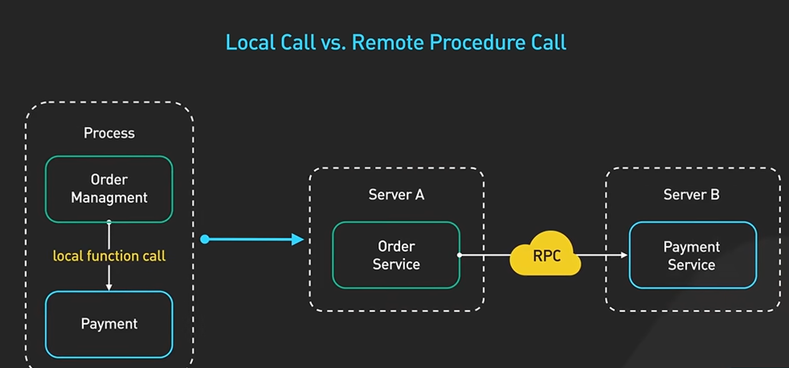
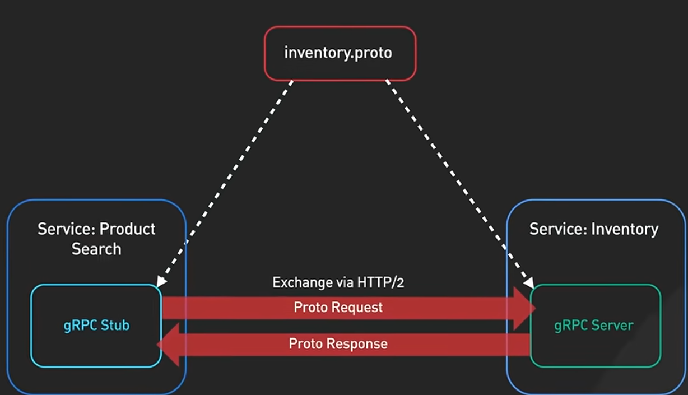
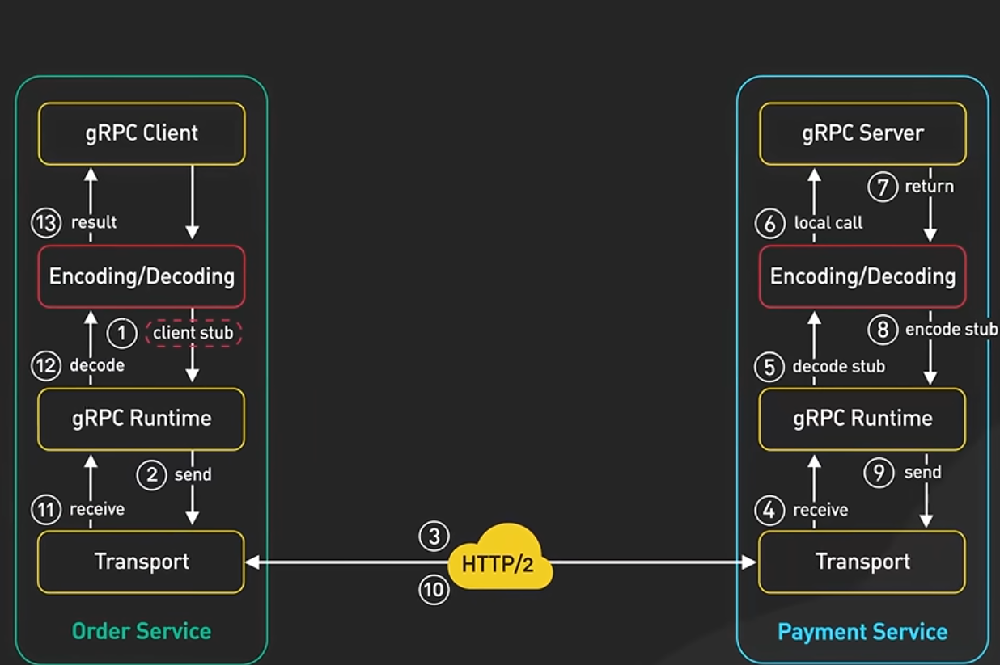

Application programming interface- It is a way for 2 computers to talk to each other 
# REST
Representational State Transfer- set of rules that has been common standard for building web API

Rest uses URI (Uniform Resource Identifiers)
- URI is preceded by an HTTP verb (
    - GET : Read the data about existing resource
    - POST : Create a new resource
    - PUT : Updating  exisitng resource
    - DELETE : Removing exisitng resource
    - PATCH : updates part of the resource, 
)
- In the body of these req, there could be an optional HTTP req body that contains json data.
- The first line of respo contains HTTP status code (200,400 etc)
- When an API is idempotent, making multiple req will have same effect. POST, PATCH are not idempotent, others are.
## Rules
- REST implementation should be stateless, means client and server do not need to store any info about each other all of the information needed to execute the operation should be present in the request itself. And every req and resp are independent from all others
- Resources must be identified by unique URLS (ex /users) URL's must be verb free
-Error handling : Errors must use standard HTTP codes
- Versioning should be there, versioning allows backward compatibility that means when an API evolves, older clients can continue with previous API (/v1/users) while the new clients adopt the latest ones (/v2/users)

# gRPC 
Google Remote procedural call 
RPC- A remote procedure call is a func call enables one machnie to invoke some code on another machine 

## Protocol Buffers
It is a language-agnostic and platform agnostic mechanism for encoding structured data
- gRPC uses protocol buffers to encode and send data over wire by default 
- Protocol buffer is very efficient binary encoding format, much faster than JSON
- Supports strongly typed schema definitions, the structure of the data over the wire is defined in a proto file 
-  gRPC service is also defined in proto file by specifying RPC method parameters and return types 
- It uses HTTP2 streams to send multiple mssgs over a single connetion

